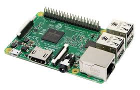
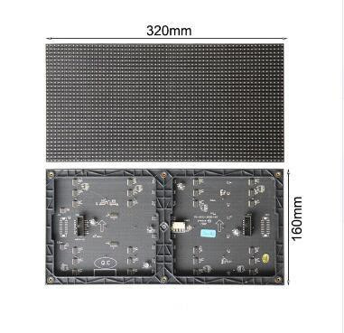
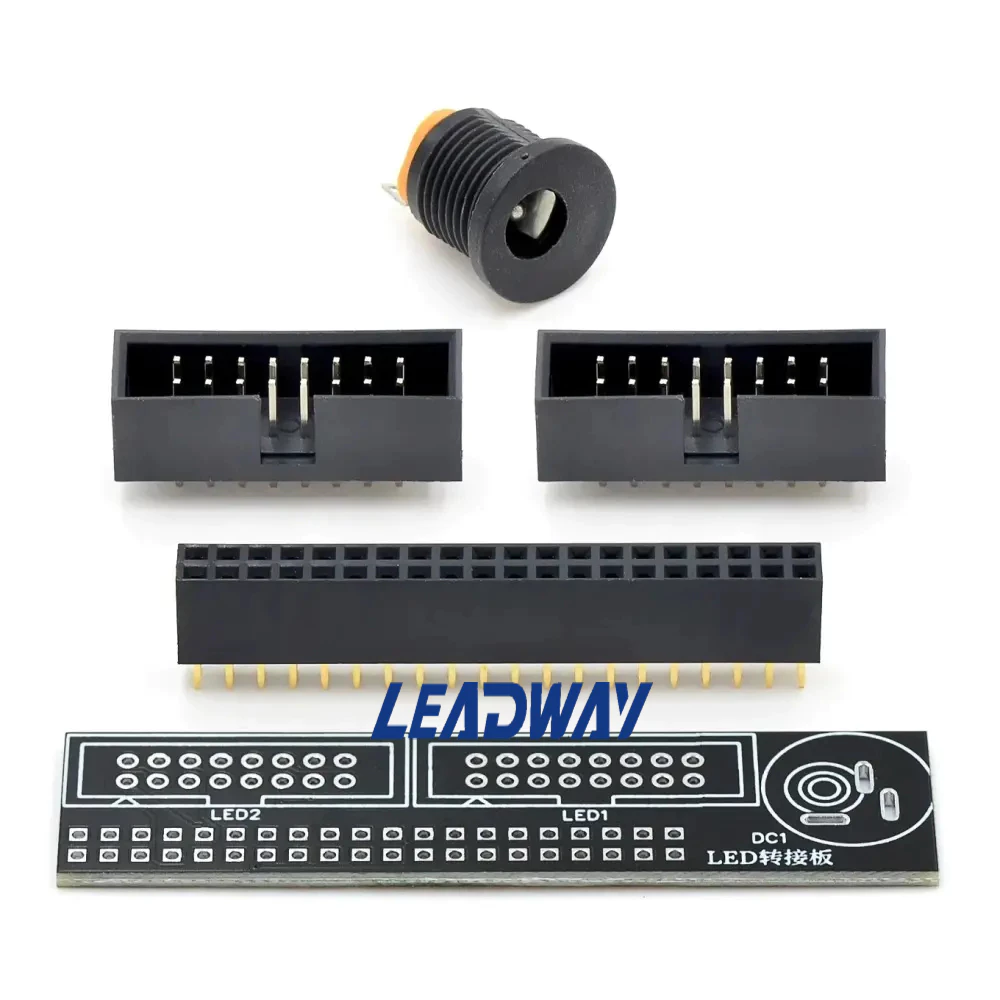
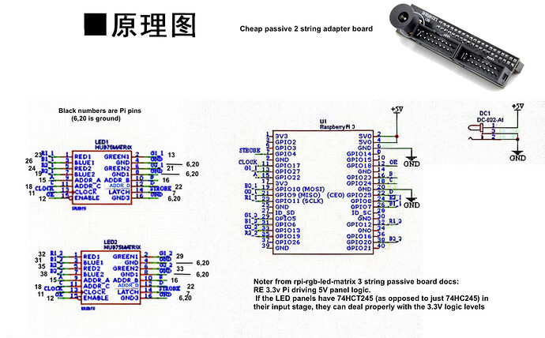
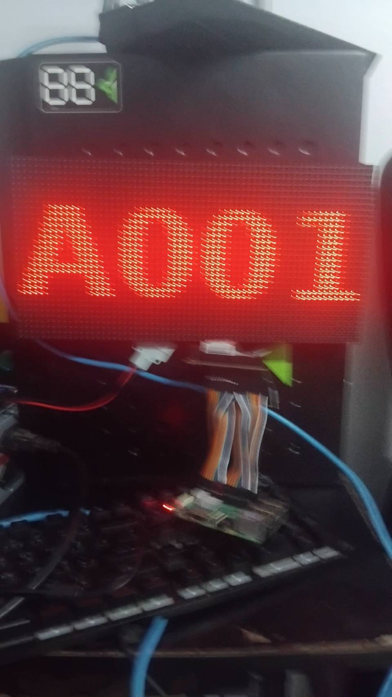
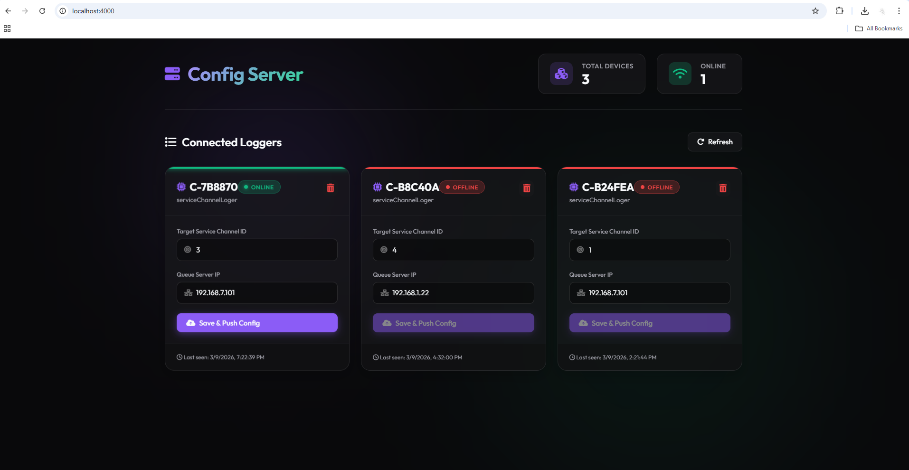

# Raspberry Pi HUB75 LED Matrix Setup

คู่มือนี้อธิบายการติดตั้งและใช้งาน HUB75 RGB LED Matrix บน Raspberry Pi โดยใช้ library rpi-rgb-led-matrix

โฟลเดอร์โปรเจกต์

```
~/rpi-rgb-led-matrix/examples-api-use
```

Library
https://github.com/hzeller/rpi-rgb-led-matrix

---

# Hardware Requirement

* **Raspberry Pi 3 / 4**
  - 
* **HUB75 RGB LED Matrix Panel**
  - 
* **HUB75 Connector**
  - ⚠️ **ข้อพึงระวัง (สำคัญมาก):** ของที่สั่งมาตอนแรกแบบประกอบสำเร็จ โรงงานมักจะบัดกรีกลับหัวมาให้ ทำให้ใช้งานกับ Raspberry Pi ได้ผิดทิศทาง เราต้องทำการ **"ซื้อตัวที่ยังไม่ได้บัดกรีมา แล้วทำการบัดกรีตัวหัว GPIO ใหม่ให้กลับด้าน"** ด้วยตัวเอง
  - *รูปร่างของพินที่ควรสั่งซื้อมา (ยังไม่ได้บัดกรีขา)*:
    
  - *ภาพวิธีบัดกรี Connector ใหม่ (เพื่อให้เสียบถูกด้าน)*:
    
  - *ลักษณะและผลลัพธ์การประกอบชิ้นส่วนเข้ากับ Pi*:
    
* **Power Supply 5V**
* **HUB75 Ribbon Cable**

**ภาพแสดงอุปกรณ์เมื่อประกอบเสร็จสมบูรณ์:**


---

# Update Raspberry Pi

อัปเดตระบบก่อนติดตั้ง

```bash
sudo apt update
sudo apt upgrade -y
```

---

# ปิดระบบเสียง (สำคัญ)

LED Matrix library ใช้ DMA ซึ่งอาจชนกับระบบเสียงของ Raspberry Pi

เปิดไฟล์ config

```bash
sudo nano /boot/config.txt
```

หา

```
dtparam=audio=on
```

เปลี่ยนเป็น

```
dtparam=audio=off
```

เพิ่มบรรทัดนี้ด้านล่างไฟล์

```
core_freq=500
```

บันทึกไฟล์

```
CTRL + X
Y
ENTER
```

รีสตาร์ทเครื่อง

```bash
sudo reboot
```

---

# Install Dependencies

ติดตั้งเครื่องมือที่จำเป็น

```bash
sudo apt install -y git python3 python3-pip python3-dev build-essential
```

---

# Download LED Matrix Library

```bash
git clone https://github.com/hzeller/rpi-rgb-led-matrix.git
cd rpi-rgb-led-matrix
```

---

# Compile Python Library

```bash
make build-python PYTHON=$(which python3)
```

ติดตั้ง Python binding

```bash
sudo make install-python PYTHON=$(which python3)
```

---

# เข้าโฟลเดอร์ Project

```bash
cd ~/rpi-rgb-led-matrix/examples-api-use
```

---

# สร้างไฟล์โปรแกรม test.py

```bash
nano test.py
```

วาง code นี้

### Source Code (test.py)

```python
import socketio
import websocket
import json
import os
import time
import threading
from datetime import datetime
from rgbmatrix import RGBMatrix, RGBMatrixOptions
from PIL import Image, ImageDraw, ImageFont


# =========================================================
# CONFIGURATION
# =========================================================

# Config server สำหรับรับค่าตั้งค่า device
CONFIG_SERVER = "http://192.168.1.106:4000"

# ไฟล์เก็บ config ของเครื่อง
CONFIG_FILE = "/root/config.json"

# ฟอนต์ที่ใช้แสดงผลบน LED
FONT_PATH = "/usr/share/fonts/truetype/oswald/Oswald.ttf"


# =========================================================
# LOGGER
# ใช้สำหรับแสดง log พร้อม timestamp
# =========================================================

def log(msg):
    print(f"[{datetime.now().strftime('%H:%M:%S')}] {msg}")


# =========================================================
# LED MATRIX SETUP
# =========================================================

options = RGBMatrixOptions()

# ขนาด panel
options.rows = 32
options.cols = 64

# จำนวน panel ที่ chain
options.chain_length = 1
options.parallel = 1

# mapping ของ HUB75
options.hardware_mapping = "regular"

# ความสว่าง
options.brightness = 100

# slowdown gpio (ช่วยให้ panel เสถียรขึ้น)
options.gpio_slowdown = 5

# สร้าง matrix object
matrix = RGBMatrix(options=options)

# โหลด font
font = ImageFont.truetype(FONT_PATH, 23.5)


# =========================================================
# DISPLAY FUNCTIONS
# =========================================================

def show_text(text):
    """
    แสดงหมายเลขคิวบน LED Matrix
    """

    # สร้าง canvas ขนาด 64x32
    image = Image.new("RGB", (64, 32))
    draw = ImageDraw.Draw(image)

    text = str(text)

    # เติม 0 ด้านหน้าให้ครบ 5 หลัก
    text = text.zfill(5)

    # วาดตัวอักษรทีละตัว
    for i, char in enumerate(text[:5]):

        # คำนวณขนาดตัวอักษร
        bbox = draw.textbbox((0, 0), char, font=font)
        text_width = bbox[2] - bbox[0]
        text_height = bbox[3] - bbox[1]

        log(i)
        log(text_width)

        # ตัวแรกตำแหน่งพิเศษ
        if i == 0:
            x = 1
        else:
            # คำนวณตำแหน่งช่องตัวเลข
            x = ((i * 12) - (text_width - 2)) + 12

        y = -3

        # วาดตัวเลขสีแดง
        draw.text((x, y), char, font=font, fill=(255, 0, 0))

    # ส่งภาพไปแสดงบน LED
    matrix.SetImage(image)

    log(f"DISPLAY QUEUE → {text}")


def clear_screen():
    """
    ล้างหน้าจอ LED
    """
    matrix.Clear()
    log("DISPLAY CLEARED")


# =========================================================
# CONFIG MANAGEMENT
# =========================================================

config = {}
device_id = None


def load_config():
    """
    โหลด config จากไฟล์
    """

    global config

    if os.path.exists(CONFIG_FILE):

        with open(CONFIG_FILE, "r") as f:
            config = json.load(f)

        log("Config loaded")

    else:

        config = {}
        log("Config file not found")


def save_config():
    """
    บันทึก config ลงไฟล์
    """

    with open(CONFIG_FILE, "w") as f:
        json.dump(config, f)

    log("Config saved")


# =========================================================
# QUEUE WEBSOCKET
# ใช้รับ event จาก queue server
# =========================================================

queue_thread = None
queue_ws = None
queue_stop_flag = False


def handle_queue(data):
    """
    จัดการข้อมูล queue ที่ได้รับ
    """

    if not data:
        return

    # ตรวจสอบว่าเป็น channel ที่ต้องการหรือไม่
    if str(data.get("serviceChannelId")) != str(config.get("serviceChannelTagetId")):
        return

    status = data.get("status")

    log(f"QUEUE EVENT → {data}")

    # ถ้าสถานะกำลังเรียกคิว
    if status in ["CALLING", "REPEAT"]:
        show_text(data.get("queueNumber"))

    else:
        clear_screen()


def on_queue_open(ws):
    log("Connected to Queue Server")


def on_queue_error(ws, error):
    log(f"Queue WS Error → {error}")


def on_queue_close(ws, code, msg):
    log(f"Queue WS Closed → {code} {msg}")


def on_queue_message(ws, message):
    """
    รับ message จาก queue websocket
    """

    log(f"WS MESSAGE → {message}")

    try:
        data = json.loads(message)

    except:
        log("Invalid JSON received")
        return

    event = data.get("event")
    payload = data.get("data")

    # event update queue
    if event == "updated":

        print("update")
        handle_queue(payload)

    # initial state ตอน connect
    elif event == "initial_state":

        print("init")

        target_id = str(config.get("serviceChannelTagetId"))

        # filter channel ที่ต้องการ
        filtered = [
            item for item in payload
            if str(item.get("serviceChannelId")) == target_id
        ]

        if not filtered:
            clear_screen()
            return

        # เรียงตามเวลา
        filtered.sort(key=lambda x: x.get("createAt", ""))

        # เอาคิวล่าสุด
        latest = filtered[-1]

        print("LATEST QUEUE:", latest)

        handle_queue(latest)


def queue_worker():
    """
    thread สำหรับเชื่อมต่อ websocket queue server
    """

    global queue_stop_flag, queue_ws

    while not queue_stop_flag:

        qserver = config.get("qServer")

        if not qserver:

            log("Queue server not configured")
            time.sleep(3)
            continue

        url = f"ws://{qserver}:8080/queue-systems/queue-updates"

        log(f"Connecting Queue WS → {url}")

        queue_ws = websocket.WebSocketApp(
            url,
            on_open=on_queue_open,
            on_message=on_queue_message,
            on_error=on_queue_error,
            on_close=on_queue_close
        )

        try:

            queue_ws.run_forever(
                ping_interval=20,
                ping_timeout=10
            )

        except Exception as e:

            log(f"Queue connection crashed → {e}")

        log("Reconnecting Queue WS in 3 seconds...")

        time.sleep(3)


def restart_queue():
    """
    restart websocket queue
    """

    global queue_thread, queue_stop_flag, queue_ws

    log("Restarting Queue Connection")

    queue_stop_flag = True

    if queue_ws:

        try:
            queue_ws.close()
        except:
            pass

    time.sleep(1)

    queue_stop_flag = False

    queue_thread = threading.Thread(
        target=queue_worker,
        daemon=True
    )

    queue_thread.start()


# =========================================================
# CONFIG SOCKET (Socket.IO)
# ใช้รับ config จาก server
# =========================================================

config_socket = socketio.Client(
    reconnection=True,
    reconnection_attempts=0,
    reconnection_delay=5
)


@config_socket.event
def connect():
    log("Connected to Config Server")


@config_socket.event
def disconnect():
    log("Config Server Disconnected")


@config_socket.on("request_info")
def request_info(data=None):
    """
    server ขอข้อมูล device
    """

    log("Server requested device info")

    config_socket.emit("register", {
        "type": "serviceChannelLoger",
        "id": device_id
    })


@config_socket.on("init_id")
def init_id(data):
    """
    server ส่ง device id มาให้
    """

    global device_id

    device_id = data.get("id")

    config["deviceId"] = device_id

    save_config()

    log(f"Device ID → {device_id}")


@config_socket.on("config_update")
def config_update(data):
    """
    รับ config ใหม่จาก server
    """

    log(f"Config update received → {data}")

    config["serviceChannelTagetId"] = data.get("serviceChannelTagetId")
    config["qServer"] = data.get("qServer")

    save_config()

    clear_screen()

    restart_queue()


# =========================================================
# CONFIG LOOP
# =========================================================

def config_loop():
    """
    loop เชื่อมต่อ config server
    """

    while True:

        try:

            log("Connecting to Config Server...")

            config_socket.connect(CONFIG_SERVER)

            config_socket.wait()

        except Exception as e:

            log(f"Config connection error → {e}")

            time.sleep(5)


# =========================================================
# MAIN PROGRAM
# =========================================================

def main():

    # โหลด config
    load_config()

    global device_id
    device_id = config.get("deviceId")

    # เริ่ม thread config socket
    threading.Thread(
        target=config_loop,
        daemon=True
    ).start()

    # เริ่ม queue websocket
    restart_queue()

    log("System started")

    # main loop
    while True:
        time.sleep(1)


# =========================================================
# PROGRAM ENTRY
# =========================================================

if __name__ == "__main__":
    main()

```

บันทึกไฟล์

```
CTRL + X
Y
ENTER
```

---

# วิธีแก้ไข Code

เปิดไฟล์เพื่อแก้ไข

```bash
nano test.py
```

แก้ไขโค้ดตามต้องการ แล้วบันทึก

```
CTRL + X
Y
ENTER
```

---

# Run Program

รันโปรแกรมจากโฟลเดอร์โปรเจกต์

```bash
cd ~/rpi-rgb-led-matrix/examples-api-use
sudo python3 test.py
```

ถ้าติดตั้งถูกต้อง ภาพจะปรากฏบน LED Matrix

---

# Auto Start ด้วย Systemd

สร้าง service

```bash
sudo nano /etc/systemd/system/led.service
```

วาง configuration นี้

```
[Unit]
Description=LED Matrix Service
After=network.target

[Service]
ExecStart=/usr/bin/python3 /home/pi/rpi-rgb-led-matrix/examples-api-use/test.py
WorkingDirectory=/home/pi/rpi-rgb-led-matrix/examples-api-use
StandardOutput=inherit
StandardError=inherit
Restart=always
User=root

[Install]
WantedBy=multi-user.target
```

บันทึกไฟล์

```
CTRL + X
Y
ENTER
```

Reload systemd

```bash
sudo systemctl daemon-reload
```

เปิดใช้งาน Auto Start

```bash
sudo systemctl enable led.service
```

เริ่ม service

```bash
sudo systemctl start led.service
```

ตรวจสอบสถานะ

```bash
sudo systemctl status led.service
```

---

# การแก้ไข Code หลังเปิด Auto Start

เมื่อเปิด Auto Start แล้ว หากต้องการแก้ไขโค้ด ให้ทำตามขั้นตอนนี้

หยุด service ก่อน

```bash
sudo systemctl stop led.service
```

เปิดไฟล์โค้ดเพื่อแก้ไข

```bash
nano ~/rpi-rgb-led-matrix/examples-api-use/test.py
```

แก้ไขโค้ดตามต้องการ แล้วบันทึก

```
CTRL + X
Y
ENTER
```

เริ่ม service ใหม่

```bash
sudo systemctl start led.service
```

หรือ restart

```bash
sudo systemctl restart led.service
```

---

# Useful Commands

Restart service

```bash
sudo systemctl restart led.service
```

Stop service

```bash
sudo systemctl stop led.service
```

Check service status

```bash
sudo systemctl status led.service
```

---

# Done

เมื่อเปิดเครื่อง Raspberry Pi โปรแกรม LED Matrix จะเริ่มทำงานอัตโนมัติ


---

# Logger Config Server

โปรเจกต์นี้คือ **Config Server** ส่วนกลางที่สร้างขึ้นมาสำหรับอุปกรณ์ `serviceChannelLoger` โดยเฉพาะ ถูกพัฒนาด้วย **Node.js, Express, Socket.io, และ MongoDB** พร้อมการตั้งค่าเพื่อรันผ่าน **Docker Compose** ได้อย่างง่ายดาย

**ภาพหน้าจอตัวอย่างการใช้งานโปรแกรม (Config Server Dashboard):**  


## 🌟 ฟีเจอร์หลัก (Features)
1. **สร้าง ID อัตโนมัติ (Dynamic ID Generation):**
   เมื่ออุปกรณ์เชื่อมต่อเข้ามาผ่าน WebSocket แล้วส่ง Event `register` พร้อมกับกำหนด `type = 'serviceChannelLoger'` แต่ไม่ได้ส่ง `id` มาด้วย เซิร์ฟเวอร์จะทำการสร้าง `id` ให้อัตโนมัติ และผลัก (push) Event `init_id` กลับไปหาอุปกรณ์
2. **อัปเดต Config แบบเรียลไทม์ (Real-time Config Push):** 
   ค่า Config (ได้แก่ `serviceChannelTagetId` และ `qServer`) จะถูกบันทึกในฐานข้อมูลและผลัก (push) ผ่าน WebSockets ไปยังอุปกรณ์ปลายทางที่เชื่อมต่ออยู่ทันที
3. **แดชบอร์ด UI สวยงาม (Beautiful UI Dashboard):**
   ตรวจสอบจำนวนอุปกรณ์ทั้งหมด สถานะออนไลน์ ดูรายละเอียดอุปกรณ์ และสามารถกดอัปเดต Config แบบแมนนวลได้โดยตรงจากหน้าเว็บ UI ที่ใช้งานง่ายและดูทันสมัย

---

## 🚀 วิธีการรันระบบด้วย Docker Compose และการจัดการ Environment (ENV)

ระบบใช้ Docker ในการจำลองสภาพแวดล้อมเพื่อสร้างและจัดการทั้ง Node.js Application และฐานข้อมูล MongoDB

### ⚙️ วิธีแก้ไข Environment Variables (ENV)
ในไฟล์ `docker-compose.yml` ภายใต้ส่วน `services.app.environment` เป็นส่วนที่คุณสามารถแก้ไขตัวแปรได้ (หรือคุณอาจตั้งค่าตัวแปรเหล่านี้เก็บไว้ในไฟล์ `.env` ที่อยู่ในโฟลเดอร์เดียวกันก็ได้):

```yaml
    environment:
      - PORT=4000
      - MONGO_URI=mongodb://mongo:27017/configlogger
      - DEFAULT_QID=192.168.7.101
```

**คำอธิบายตัวแปรแต่ละตัว:**
- **`PORT`**: พอร์ตหลักสำหรับรองรับหน้า Dashboard UI และดักฟัง WebSocket / API (ค่าเริ่มต้นคือ `4000`) *🚨 ข้อควรระวัง: หากเปลี่ยนพอร์ตนี้ จะต้องไปเปลี่ยนการเชื่อมต่อพอร์ต (ports matching) ใน `docker-compose.yml` เช่น `"4000:4000"` ด้วย*
- **`MONGO_URI`**: Connection String หรือที่อยู่ของฐานข้อมูล กรณีรันด้วย Docker แนะนำให้ใช้ `mongodb://mongo:27017/configlogger` เป็นสากลเพื่อให้ระบบชี้ไปที่คอนเทนเนอร์ `mongo` ในเครือข่าย Docker เดียวกันโดยอัตโนมัติ
- **`DEFAULT_QID`**: ค่าหมายเลข IP หรือ DNS เริ่มต้นในการเชื่อมต่อกับเซิร์ฟเวอร์คิว (เช่น `192.168.7.101`) ระบบจะนำค่านี้ไปเป็นค่าเริ่มต้นได้ 

---

### 🛠️ ขั้นตอนการรัน Docker Compose
โปรดตรวจสอบว่าเครื่องของคุณมี [Docker](https://www.docker.com/) ได้ติดตั้งไว้แล้ว 

1. **เปิด Terminal แล้วเข้าไปที่โฟลเดอร์ของโปรเจกต์:**
   ```bash
   cd config_server
   ```
2. **สตาร์ทและเชื่อมต่อเซอร์วิสทั้งหมด (Build ใหม่ทุกครั้งเพื่อรับ Config ใหม่):**
   ```bash
   docker-compose up -d --build
   ```
   *(คำสั่งนี้จะดึง Source code ปัจจุบันไปสร้างและรันคอนเทนเนอร์ขึ้นมา 2 ตัว ได้แก่แอปพลิเคชันและฐานข้อมูล)*
3. **ตรวจสอบว่ารันขึ้นหรือไม่:**
   ```bash
   docker-compose ps
   ```
4. **เข้าใช้งานแอปพลิเคชัน:**
   - **Dashboard UI (หน้าเว็บ):** [http://localhost:4000](http://localhost:4000)
   - **เชื่อมต่อ API / WebSockets (เช่นจากอุปกรณ์):** `ws://localhost:4000` / `http://localhost:4000/api`

**(คำแนะนำเสริม):** หากต้องการยุติการทำงานและลบคอนเทนเนอร์ ให้ใช้คำสั่ง `docker-compose down` (และเติม flag `-v` หากต้องการดรอปข้อมูลในฐานข้อมูลทิ้งไปด้วย เช่น `docker-compose down -v`)

---

## 📡 ขั้นตอนการส่งข้อมูลผ่าน WebSocket (Event Flow)

เมื่อมีการเชื่อมต่อจากอุปกรณ์ (Logger Queue):
1. **ทำการเชื่อมต่อ (Connect)** ไปที่ `ws://localhost:4000` ผ่าน Socket.io
   - *เซิร์ฟเวอร์จะส่ง (emit):* `request_info` (บอกให้ Client ส่งข้อมูล id และ type มาให้)
   
2. **Client ลงทะเบียน (Registers):**
   - *Client จะส่ง (emit):* `register`
   - *ตัวอย่างข้อมูล (Payload):*
   ```json
   {
     "type": "serviceChannelLoger",
     "id": "" // ว่างเปล่าหรือ null
   }
   ```
   
3. **ถ้า ID เป็นค่าว่าง (ฟีเจอร์ 1), เซิร์ฟเวอร์จะสร้าง ID และตอบกลับ:**
   - *เซิร์ฟเวอร์จะส่ง (emit):* `init_id`
   - *ตัวอย่างข้อมูล (Payload):* `{ "id": "C-1A2B3C", "type": "serviceChannelLoger" }`

4. **เมื่อมีการอัปเดต Config จากหน้า Dashboard หรือผ่าน API (ฟีเจอร์ 2):**
   - *เซิร์ฟเวอร์จะส่ง (emit):* `config_update`
   - *ตัวอย่างข้อมูล (Payload):* `{ "serviceChannelTagetId": "Channel_5", "qServer": "192.168.7.101" }`

---

## 📮 การทดสอบใช้งานผ่าน Postman

คุณสามารถใช้ Postman ในการตรวจสอบสถานะอุปกรณ์ และทดสอบการอัปเดตค่า Config

### 1. **ดึงข้อมูลอุปกรณ์ทั้งหมด (Get All Devices)**
- **Method:** `GET`
- **URL:** `http://localhost:4000/api/devices`
- **รายละเอียด:** ส่งคืนข้อมูลอุปกรณ์ทั้งหมดที่ลงทะเบียนใน MongoDB พร้อมกับสถานะว่าออนไลน์อยู่หรือไม่

### 2. **อัปเดต & Push Config (Save & Push)**
- **Method:** `POST`
- **URL:** `http://localhost:4000/api/config/:deviceId` 
  *(แทนที่ `:deviceId` ด้วย ID จริง เช่น `C-82DD2B`)*
- **Headers:** `Content-Type: application/json`
- **Body (raw JSON):**
  ```json
  {
      "serviceChannelTagetId": "Counter_A1",
      "qServer": "192.168.10.22"
  }
  ```
- **รายละเอียด:** อัปเดตข้อมูลลงฐานข้อมูลและทำการ **Push** Event `config_update` กลับไปที่อุปกรณ์ตัวนั้นๆ โดยทันที (หากกำลังเชื่อมต่ออยู่)

---

